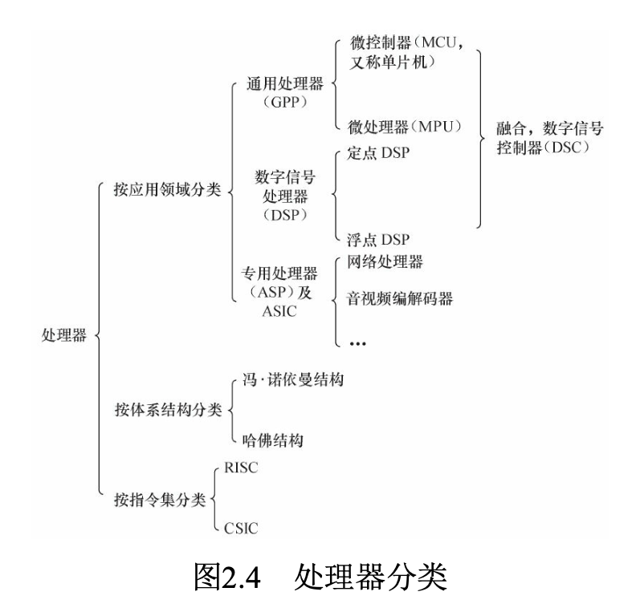
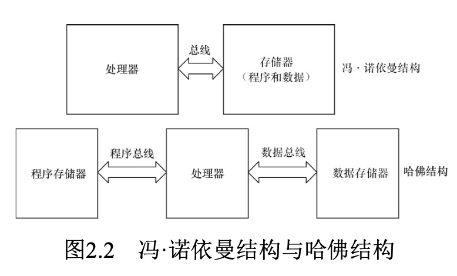
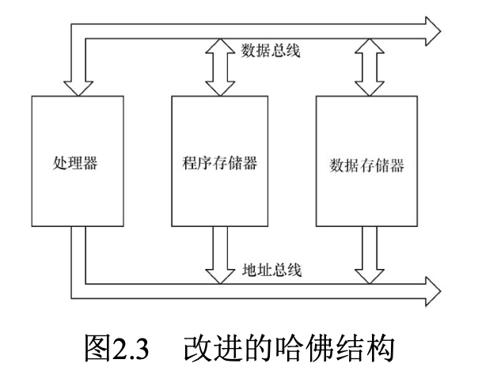
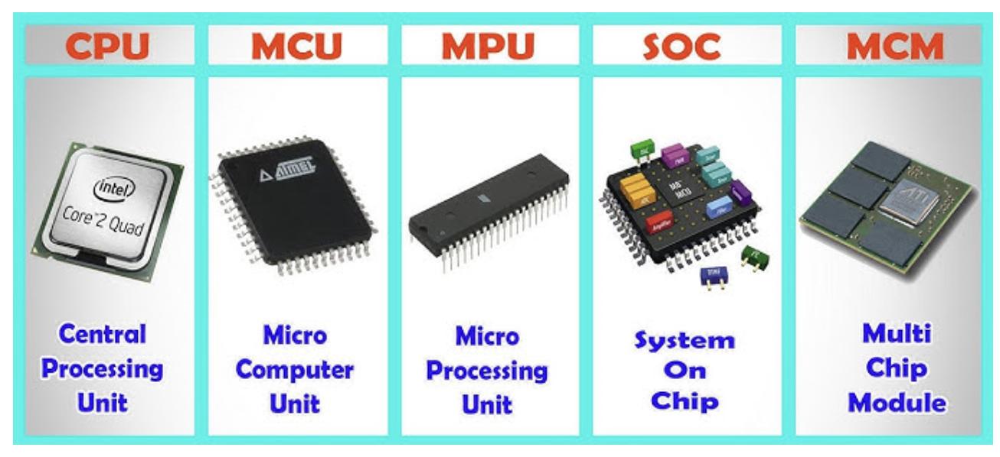
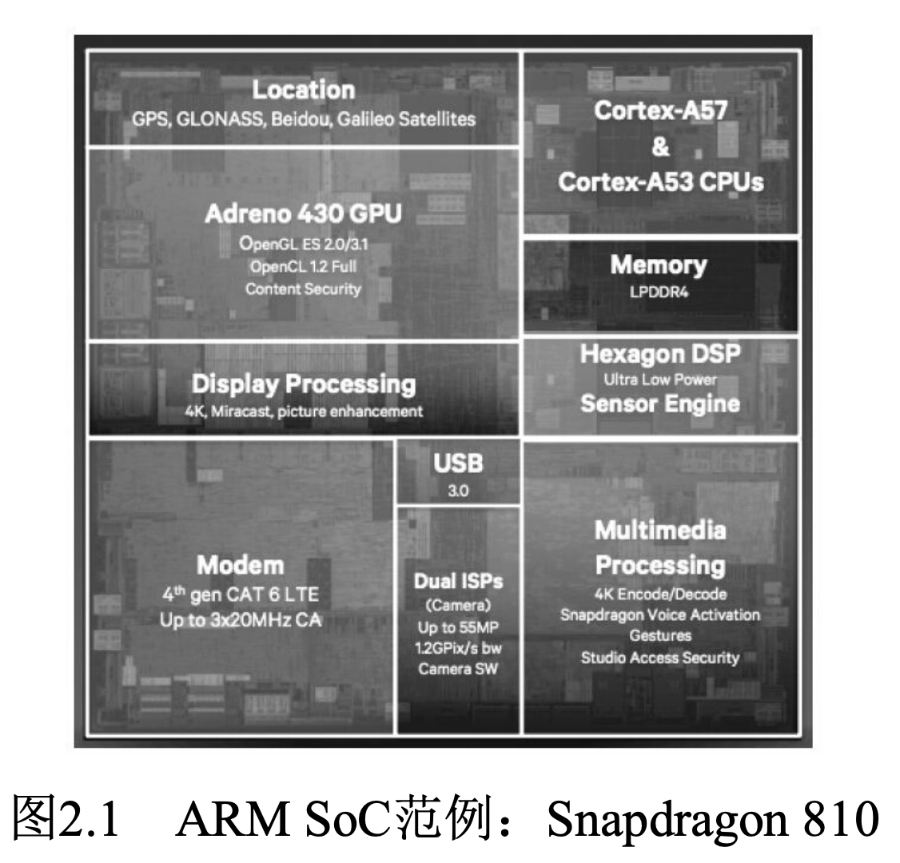

# 处理器分类

# 中央处理器的体系结构
- 冯·诺依曼结构
    - 也称普林斯顿结构
    - 是一种将**程序指令存储器和数据存储器合并在一起**的**存储器结构**
    - 程序指令存储地址和数据存储地址指向同一个存储器的不同物理位置，因此程序指令和数据的宽度相同
    - Intel公司的中央处理器、ARM的ARM7、MIPS公司的MIPS处理器采用了冯·诺依曼结构
- 哈佛结构
    - 将程序指令和数据分开存储，指令和数据可以有不同的数据宽度
    - 独立的程序总线和数据总线
    - AVR、ARM9、ARM10、 ARM11以及Cortex A系列等则采用了哈佛结构

# 指令集
- RISC(精简指令集计算机)
- CISC(复杂指令集计算机)

# GPP
- 通用处理器（GPP, General Purpose Processor）
- 常见的 GPP 包括 Intel 的 x86 系列、ARM 架构处理器等。
- 适用于个人电脑、服务器、嵌入式设备等。
- 和cpu比较
    - GPP 是一个更广义的概念，指代所有通用用途的处理器
    - 而 CPU 是计算机系统中具体的通用处理器实例

# dsp
- 数字信号处理器（DSP，Digital Signal Processor）
- 针对通信、图像、语音和视频处理等领域的算法而设计
- 它包含独立的硬件乘法器。
- DSP的乘法指令一般在单周期内完成，且优化了卷积、数字滤波、FFT(快速傅里叶变换)、相关矩阵运算等算法中的大量重复乘法

# CPU、MCU、MPU、SOC和MCM
- SOC > MCU > (cpu == MPU)
- MCU
    - Microcontroller Unit，微控制器单元
    - **把CPU、RAM、ROM、定时器和输入输出I/O引脚集成在一个芯片上**
    - 比如51、STC、Cortex-M这些芯片，它们的内部除了CPU外还包含了RAM和ROM
    - 直接添加简单的器件（电阻/电容）等构成最小系统就可以运行代码了
- MPU
    - Microprocessor Unit，微处理器单元
    - 是一种更具体的CPU类型，微处理器通常代表功能强大的CPU（可理解为**增强型的CPU**）
- SOC
    - System on Chip，片上系统
    - 包括CPU核心、内存、输入/输出控制器、外围设备和其他功能模块
    - **MCU只是芯片级的芯片，而SOC是系统级的芯片**
    - **它可以存放并运行系统级别的代码，也就是说可以运行操作系统**
- SoPC
    - System on a Programmable Chip，可编程片上系统
- MCM
    - multi chip module, 多芯片模块
    - MCM 是一种将多个芯片（如 CPU、GPU、存储器等）封装在一个模块中的技术
    - 多芯片封装： MCM 内部包含多个芯片，这些芯片通过高速互连通信。
    - 高性能： 由于多个芯片协同工作，性能比单芯片更强。
    - 优点： 性能强大，适合复杂计算任务。
    - 缺点： 成本高，功耗较大，设计复杂。  
   

# ARM SoC范例
