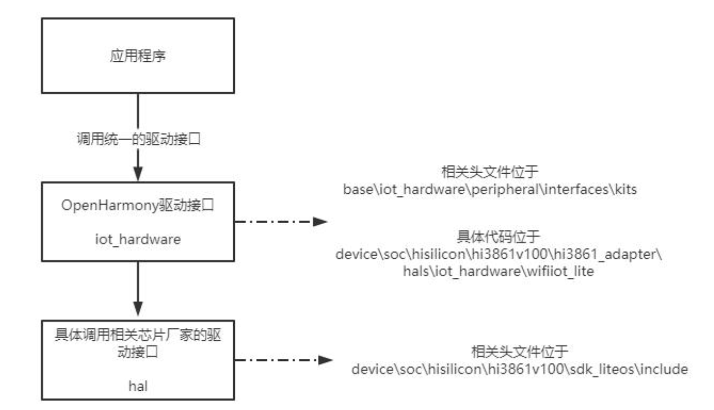

# 摘要
- 介绍的 **Hi3861 的应用**的开发
- Hi3861 已经把 liteos-m 写入到了rom中
    - 驱动移植
    - 可以直接使用liteos-m

# 流程
- 配置文件
    - vendor\hisilicon\hispark_pegasus\config.json
        - 产品名称、OpenHarmony 版本、使用的内核类型
        - 子系统
            - 应用子系统
            - 驱动子系统
- 应用子系统
    - ./applications/sample/wifi-iot/app 
- 硬件驱动子系统
    - 头文件路径: base\iot_hardware\peripheral\interfaces\kits
    - 具体代码路径
        - 由 device\board\hisilicon\hispark_pegasus\liteos_m\config.gni 指定
        - board_adapter_dir = "//device/soc/hisilicon/hi3861v100/hi3861_adapter"
    - 开发板驱动   
    - 

# 参考
- OpenHarmony设备开发入门.pdf
