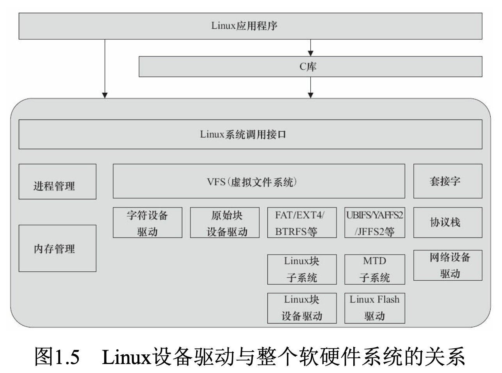
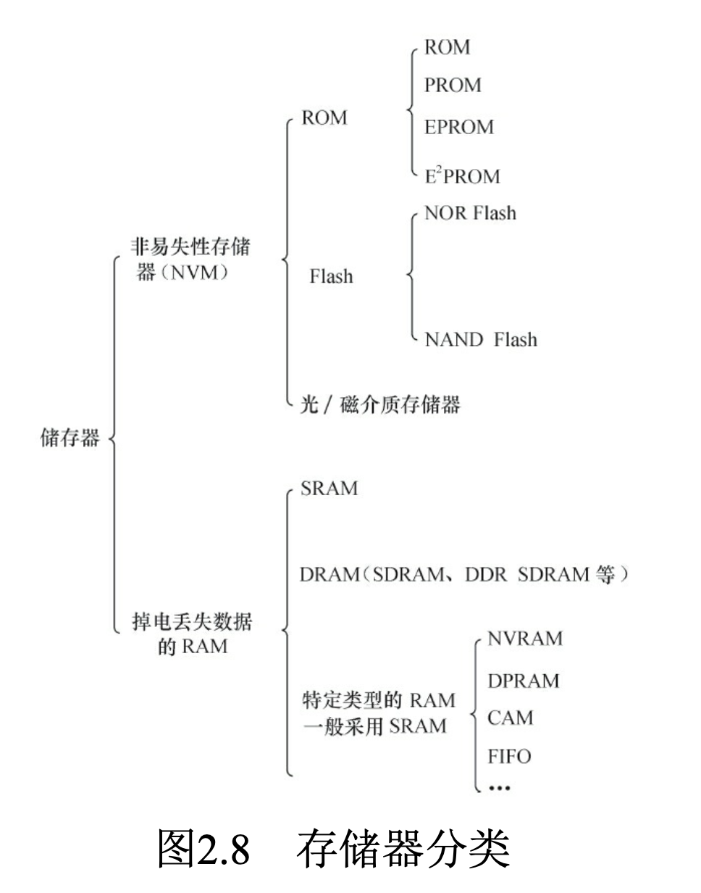
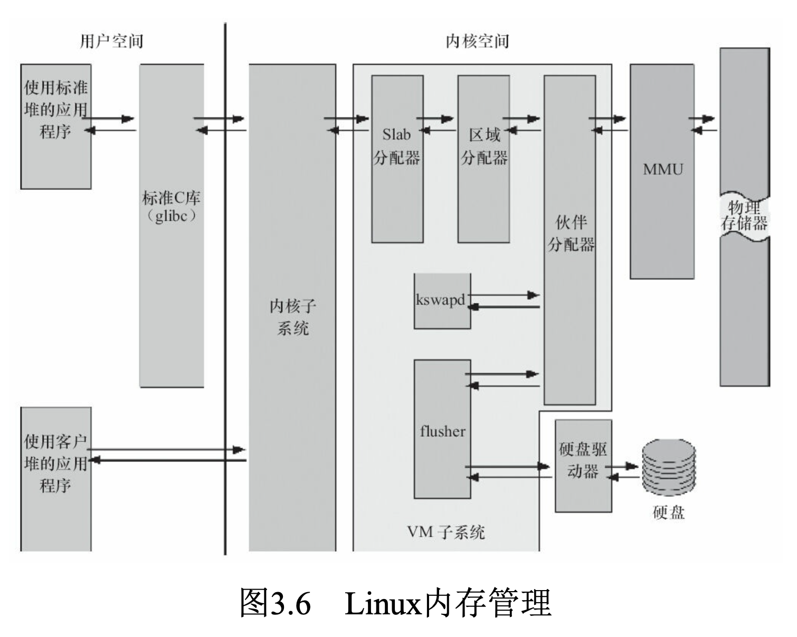
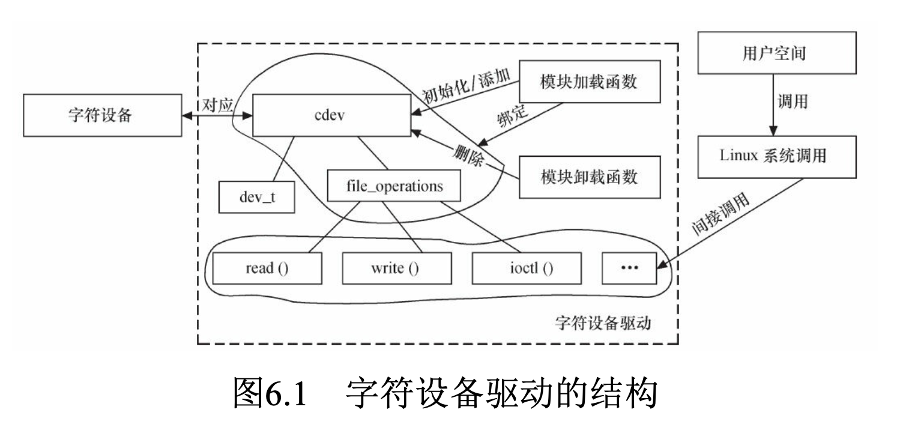
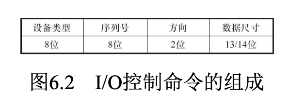
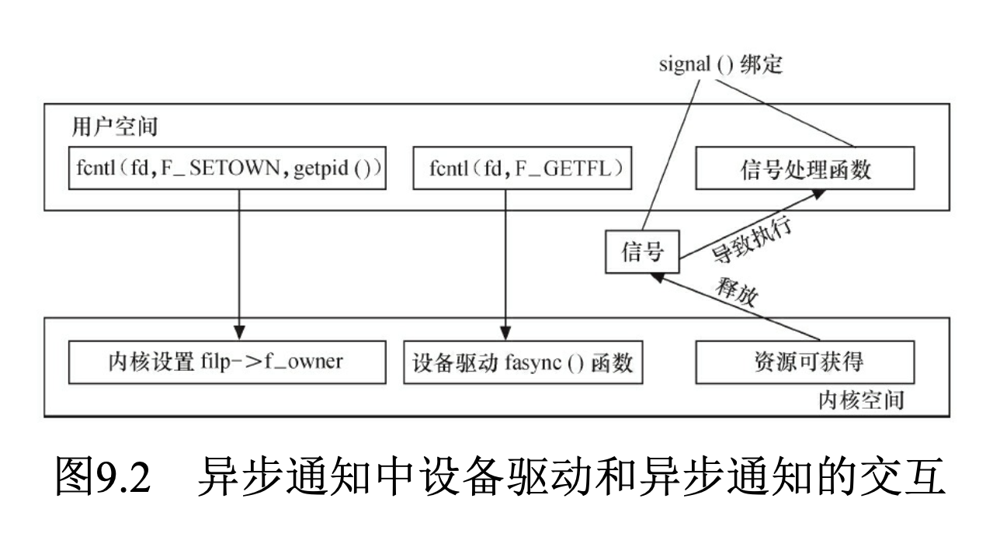

# Linux设备驱动与整个软硬件系统的关系


# 存储器分类


# Linux内存管理

    
# 字符设备驱动
Linux驱动编程的本质属于Linux内核编程




## 编译乱序
- 现代的高性能编译器**在目标码优化上**都具备**对指令进行乱序优化的能力**
- `p->a=1;p->b=2;p->c=3;gp=p;`
- 编译结果的指令顺序可能是gp的赋值指令发生在a、b、c的赋值之前
- 解决编译乱序问题，需要通过barrier()编译屏障进行
```
#define barrier() __asm__ __volatile__("": : :"memory") 
int main(int argc, char *argv[])
{
    int a = 0, b, c, d[4096], e; e = d[4095];
    barrier();
    b = a;
    c = a;
    printf("a:%d b:%d c:%d e:%d\n", a, b, c, e); return 0;
}
```

## 执行乱序
- DMB(数据内存屏障):在DMB之后的显式内存访问执行前，保证所有在DMB指令之前的内存访问完成;
- DSB(数据同步屏障):等待所有在DSB指令之前的指令完成(位于此指令前的所有显式内存访问均完成，位于此指令前的所有缓存、跳转预测和TLB维护操作全部完成);
- ISB(指令同步屏障):Flush流水线，使得所有ISB之后执行的指令都是从缓存或内存中获得的。
- **在请求获得锁时，调用屏障指令;在解锁时，也需要调用屏障指令。**
- 内存屏障API
    - 读写屏障mb()、读屏障rmb()、写屏障wmb()
    - 作用于寄存器读写的__iormb()、__iowmb()
    - `readb_relaxed/readw_relaxed/readl_relaxed`，无屏障
    - `readb/readw/readl`，有屏障
    - `#define readb(c) ({ u8 __v = readb_relaxed(c); __iormb(); __v; })`

