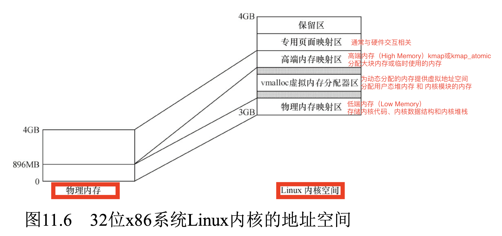
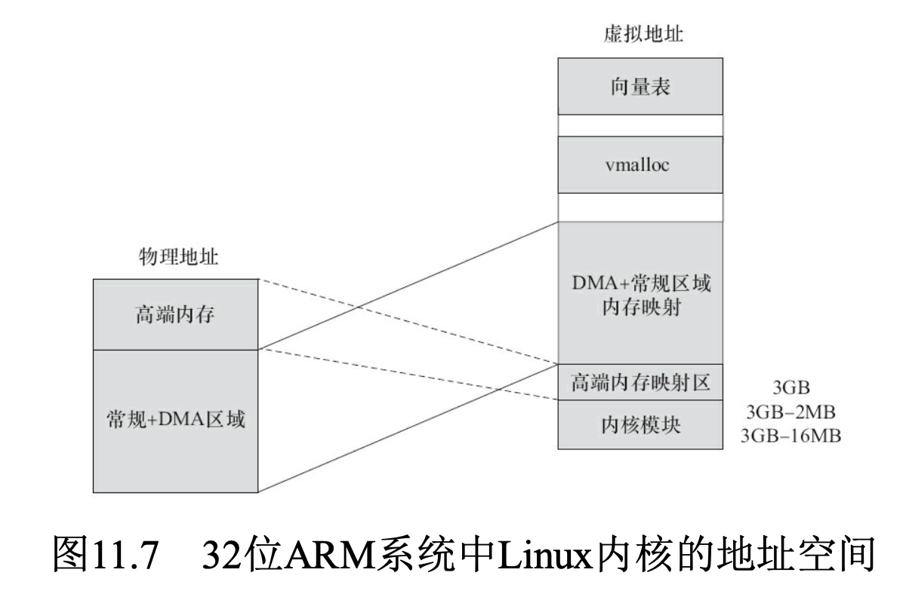
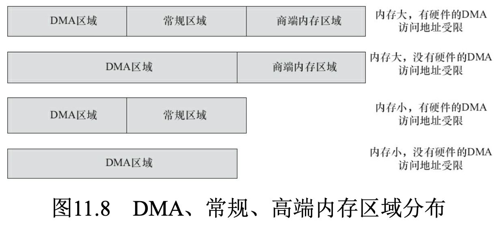

# 内存与IO
## 内存空间与I/O空间
- 内存空间主要用于存储和处理数据
- **I/O空间用于与外部设备通信**
- 通过内存映射I/O 可以实现一定程度的统一
- 内存空间是必需的，而I/O空间是可选的
    - 在X86处理器中存在着I/O空间的概念
    - 大多数嵌入式微控制器(如ARM、PowerPC等)中并不提供I/O空间，而仅存在内存空间

## 内存管理单元（MMU）
- 地址转换：将虚拟地址转换为物理地址，支持虚拟内存机制。
- 内存保护：防止非法访问，确保进程之间的内存隔离。
- 缓存控制：管理缓存一致性，优化内存访问性能。
- 分页/分段支持
    - **分页（Paging）**：通过固定大小的页简化内存管理，减少外部碎片。
    - **分段（Segmentation）**：提供逻辑分段，便于程序员管理代码段、数据段和堆栈段。

## 32位x86内存布局
- 内核空间    
    - 占用虚拟地址空间的高1GB（0xC0000000 ~ 0xFFFFFFFF）。
    - 所有进程共享同一个内核空间。
    - 
    - 
    -     
    - 分为
        - 保留区，FIXADDR_TOP~4GB
        - 专用页面映射区，FIXADDR_START~FIXADDR_TOP
        - 高端内存（High Memory）
            - **超过低端内存范围的物理内存**，需要通过动态映射访问。
            - 高端内存的物理地址通过页表**动态映射**到虚拟地址空间，kmap或kmap_atomic
            - 用于分配大块内存或临时使用的内存。
            - 起始地址为PKMAP_BASE
        - vmalloc虚拟内存分配器区，VMALLOC_START~VMALLOC_END
        - 低端内存（Low Memory）/物理内存映射区
            - 直接映射到物理内存的区域，通常为**物理内存的前896MB**。
            - 地址范围：0xC0000000 ~ 0xC37FFFFF。
            - 用于存储内核代码、内核数据结构和内核堆栈。
            - 分为
                - DMA区域：在低于16MB的区域，ISA设备可以做DMA
                - 常规区域：16MB~896MB之间
- 用户空间
    - 占用虚拟地址空间的低3GB（0x00000000 ~ 0xBFFFFFFF）。
    - 每个用户进程都有独立的用户空间。
    - 用于存储用户程序代码、数据和堆栈。

## 用户态内存分配
- malloc
  - 是C标准库函数，用于动态分配内存
  - 小块内存分配通常基于`brk`
  - 大块内存分配通常基于`mmap`

- brk系统调用
  - 通过调整进程数据段（heap）的大小来分配内存
  - 适合小块内存分配，内存是连续的
  - brk 的实现更简单，直接依赖基础伙伴系统，避免了 slab 的额外开销

- mmap系统调用
  - 通过映射文件或匿名内存分配内存
  - 适合大块内存分配，内存地址可能不连续
  - 支持文件映射和共享内存
  - 用户进行mmap()系统调用，最终会调用驱动中的mmap()
  - **对于显示、视频等设备，建立映射可减少用户空间和内核空间之间的内存复制**

## 内核态内存分配
- **buddy算法（伙伴系统）**
    - **内核的基础内存分配机制**。
    - **分配物理地址连续的内存页（2的幂次大小的页）**
    - 空闲链表：每种块大小都有一个空闲链表，用于存储空闲的块。
    - 页描述符：每个内存页都有一个描述符，记录页的状态（如是否空闲）。 
- 小块内存
    - __get_free_pages
        - __get_free_pages/free_pages
        - 申请的内存位于DMA和常规区域的映射区，物理地址和虚拟地址都是连续的
        - 它们与真实的物理地址只有一个固定的偏移，因此存在较简单的转换关系
        - 分配小块或多页内存，适合对物理地址连续性有要求的场景（如 DMA 操作）
        - 基于伙伴系统实现。
    - kmalloc
        - 基于 __get_free_pages
        - kmalloc/kfree
        - 适合小块内存分配
    - slab
        - 高效分配小块内存的机制。
        - 它通过**预分配内存块**来减少频繁的内存分配和释放操作。
        - 减少碎片：通过缓存和复用内存块，减少内存碎片。
        - 支持对象复用：适合分配内核对象（如进程控制块）。  
        - 工作原理
            - slab 分配器通过底层内存分配机制（如 kmalloc 或 __get_free_pages）获取内存页。
            - 将内存页划分为多个小块，并管理这些小块的分配和释放。  
    - 内存池
        - 是一种为特定用途预分配内存的机制
        - 初始化时，从内核分配一块较大的内存。
        - **将这块内存划分为多个固定大小的小块。**
        - 运行时直接从内存池中分配小块内存，而不是调用内核分配器。
- 大块内存
    - vmalloc
        - vmalloc/vfree
        - 虚拟地址连续，但物理地址不连续
        - 分配大块内存（如超过 1MB 的内存）
        - 访问速度比`kmalloc`慢。     

## I/O内存静态映射
- 外设I/O内存物理地址到虚拟地址的静态映射
- map_desc结构体数组