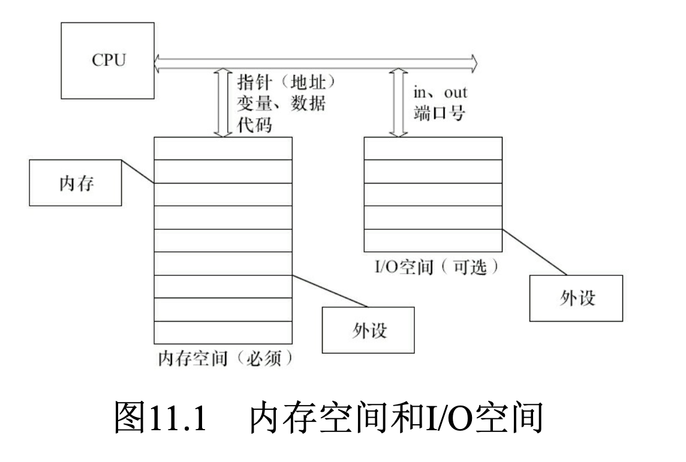

# **总结**
- 内存空间主要用于存储和处理数据
- I/O空间用于与外部设备通信
- 通过内存映射I/O 可以实现一定程度的统一
- 内存空间是必需的，而I/O空间是可选的
    - 在X86处理器中存在着I/O空间的概念
    - 大多数嵌入式微控制器(如ARM、PowerPC等)中并不提供I/O空间，而仅存在内存空间
    

# **内存空间与I/O空间的区别**
| **属性**         | **内存空间**                     | **I/O空间**                     |
|------------------|----------------------------------|----------------------------------|
| **用途**         | 存储程序和数据                  | 与外部设备交互                  |
| **访问速度**     | 高速                           | 较慢                           |
| **地址范围**     | 由系统位数决定                 | 由设备数量和架构决定            |
| **访问方式**     | 普通内存指令                   | 内存映射 或 专用I/O指令(in/out)           |
| **易失性**       | 易失性                         | 设备决定（如硬盘非易失性）      |

# **1. 内存空间**
内存空间是计算机用于存储程序和数据的区域，主要由随机存取存储器（RAM）组成。

## **特点**
- **高速访问**：内存的访问速度快，适合存储需要频繁读取和写入的数据。
- **易失性**：内存中的数据在断电后会丢失。
- **地址范围**：内存空间的地址范围由系统的位数决定（如32位系统支持4GB地址空间）。
- **用途**：
  - 存储操作系统、应用程序代码。
  - 存储运行时数据（如变量、堆栈、缓冲区等）。

## **访问方式**
- CPU通过内存地址总线直接访问内存空间。
- 通过加载指令（如`LOAD`）和存储指令（如`STORE`）操作内存中的数据。

---

# **2. I/O空间**
I/O空间是计算机用于与外部设备（如硬盘、键盘、显示器等）进行数据交换的区域。

## **特点**
- **低速访问**：I/O设备的访问速度通常比内存慢。
- **非易失性**：某些I/O设备（如硬盘）中的数据在断电后不会丢失。
- **独立地址空间**：I/O空间的地址范围通常与内存空间分离，具体取决于系统架构。
- **用途**：
  - 与外部设备通信。
  - 控制设备的状态（如启动、停止、读取数据等）。

## **访问方式**
- **内存映射I/O（Memory-Mapped I/O）**：
  - I/O设备的寄存器映射到内存地址空间，CPU通过普通的内存访问指令操作I/O设备。
  - 优点：统一了内存和I/O的访问方式。
  - 缺点：占用了部分内存地址空间。
- **端口映射I/O（Port-Mapped I/O）**：
  - I/O设备使用独立的地址空间，CPU通过专用指令（如`IN`和`OUT`）访问设备。
  - 优点：内存地址空间与I/O地址空间分离。
  - 缺点：需要额外的指令支持。
