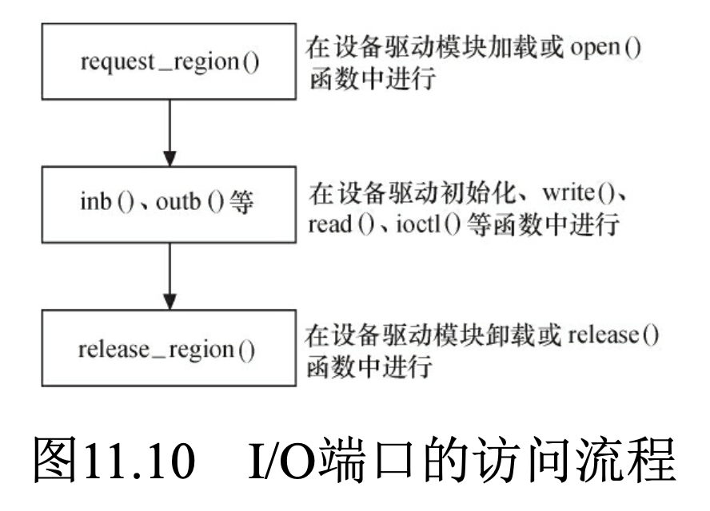
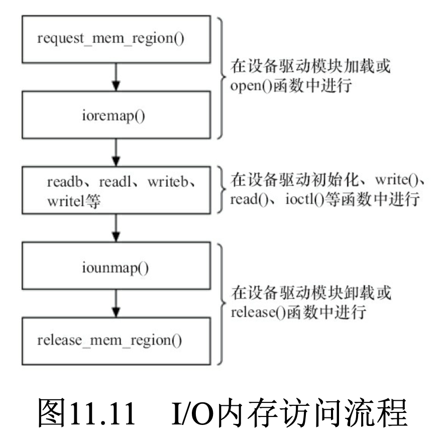

# IO端口和IO内存
- 设备通常会提供一组寄存器来控制设备、读写设备和获取设备状态，即控制寄存器、数据寄存器和状态寄存器
- 这些寄存器位于I/O空间时，通常被称为**I/O端口**; 当位于内存空间时，对应的内存空间被称为**I/O内存**

# I/O端口的访问流程

# I/O内存访问流程
- 内存屏障API
    - 读写屏障mb()、读屏障rmb()、写屏障wmb()
    - 作用于寄存器读写的__iormb()、__iowmb()
    - `readb_relaxed/readw_relaxed/readl_relaxed`，无屏障
    - `readb/readw/readl`，有屏障
    - `#define readb(c) ({ u8 __v = readb_relaxed(c); __iormb(); __v; })`

# 将设备地址映射到用户空间
- **设备驱动程序中可实现mmap（file_operations中mmap）**，这个函数可使得用户空间能直接访问设备的物理地址
- 用户进行mmap()系统调用，最终会调用驱动中的mmap()
- **对于显示、视频等设备，建立映射可减少用户空间和内核空间之间的内存复制**