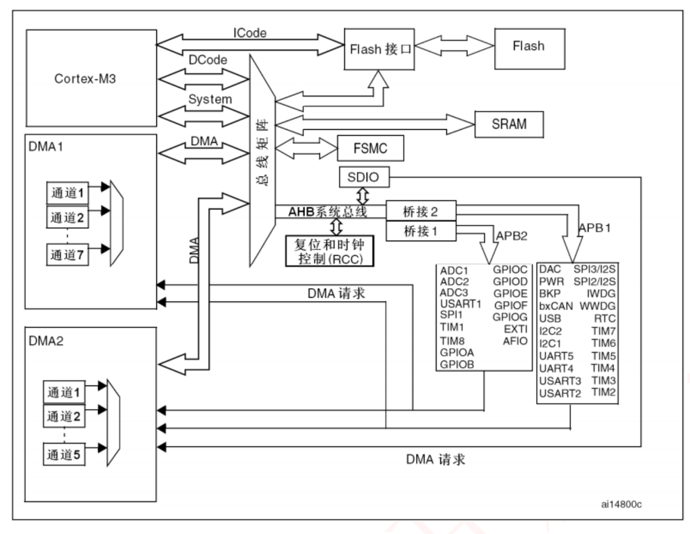

# 总结
这张图完整展示了 STM32 的 “内核 - 总线 - 外设” 架构：
- 内核通过多级总线（ICode/DCode/System/DMA/AHB/APB）访问存储和外设；
- 总线分层（AHB 高速、APB 低速）平衡性能与功耗；
- DMA 实现 “外设 - 内存” 的无 CPU 干预数据传输；
- RCC 统一管理时钟，外设按功能和速度挂在不同总线上，各司其职
# 核心层：Cortex - M3 内核与指令 / 数据通路
- **Cortex - M3**：芯片的 “大脑”，负责指令执行、计算和控制。
- **ICode（Instruction Code）**：**指令总线**，Cortex - M3 通过它从 **Flash** 中读取要执行的指令（程序存储在 Flash 中）。
- **DCode（Data Code）**：**数据总线**，用于内核从 Flash 或 SRAM 中读取常量数据或指令预取（支持内核快速访问数据）。
- **System**：**系统总线**，主要用于内核访问**外设寄存器**（如 GPIO、UART 的控制寄存器），通过总线矩阵仲裁后，连接到 AHB 系统总线。
- **DMA**：**直接内存访问总线**，为 DMA 控制器（DMA1、DMA2）提供专用通路，允许外设与内存（Flash/SRAM）直接传输数据，无需内核干预。

# 存储层：Flash、SRAM 与接口
- **Flash**：程序存储器，用于永久存储代码和常量数据。通过**Flash 接口**与 ICode/DCode 总线连接，供内核读取指令和数据。
- **SRAM**：静态随机存取存储器，用于运行时存储变量、堆栈等临时数据。通过**FSMC（灵活静态存储控制器）** 连接到 AHB 系统总线，支持高速访问。
- **FSMC**：**可扩展外部存储的接口**，除了连接内部 SRAM，还能外接外部 SRAM、NOR Flash 等设备（图中简化为连接内部 SRAM）。
- **SDIO**：**安全数字输入输出接口**，用于**连接 SD 卡等**存储设备，通过 FSMC 接入 AHB 总线，扩展外部存储能力。

# 总线层：AHB 与 APB 的分层架构
采用 **“AHB（高速总线） + APB（低速总线）”** 架构，平衡性能与功耗：
- **AHB 系统总线**：**高速总线**，连接内核、DMA、FSMC、RCC 等 “高速 / 高优先级” 组件，保证核心数据传输的带宽和速度。
- **APB2 总线**：**连接 “高速外设”**，如 GPIO（GPIOC、GPIOD 等）、ADC（ADC1 - 3）、USART1、高级定时器（TIM1、TIM8）等，这些外设需要较高的传输速度或实时性。
- **APB1 总线**：**连接 “低速外设”**，如 SPI2/3、I2C、USART2 - 3、普通定时器（TIM2 - 7）、DAC 等，对传输速度要求较低，用低速总线降低功耗。
- **桥接 1 / 桥接 2**：AHB 与 APB 之间的 “桥梁”，实现不同总线速度的适配，保证数据在高速 AHB 和低速 APB 之间可靠传输。

# 外设层：各类功能外设
框图右下方是 STM32 的**功能外设**，按总线分类挂在 APB2 或 APB1 上：
- **APB2 外设**（高速）：
    - GPIO：通用输入输出口（GPIOB - GPIOG 等），用于控制外部电路（如 LED、按键）。
    - ADC：模数转换器（ADC1 - 3），将模拟信号（如电压）转换为数字信号。
    - **USART1**：高速串口，用于串行通信（如与电脑串口调试）。
    - **高级定时器**（TIM1、TIM8）：支持 PWM、输入捕获等复杂定时功能，常用于电机控制、高精度计时。
- **APB1 外设**（低速）：
    - SPI2/3：串行外设接口，用于与 SPI 设备（如传感器、Flash）高速同步通信。
    - I2C：I2C 总线接口，用于多设备（如 EEPROM、传感器）的低速同步通信。
    - **USART2 - 3**：低速串口，满足一般串行通信需求。
    - **普通定时器**（TIM2 - 7）：基础定时、计数功能，用于普通时序控制。
    - **DAC**：数模转换器，将数字信号转换为模拟信号（如输出波形）。
    - 其他：PWR（电源管理）、BKP（备份寄存器）、RTC（实时时钟）等，实现电源、时钟、备份等辅助功能。
# 特殊组件：RCC、DMA
- **RCC（复位和时钟控制）**：STM32 的 “时钟总控”，为整个芯片（内核、总线、外设）配置时钟源和分频系数，决定各组件的工作频率（如系统时钟、外设时钟）。同时负责芯片的复位管理。
- **DMA1/DMA2（直接内存访问控制器）**：
    - **独立的 DMA 控制器**，每个有多个**通道**（如 DMA1 有通道 1 - 7，DMA2 有通道 1 - 2、5）。
    - **功能**：允许外设（如 ADC、UART）与内存（Flash/SRAM）直接传输数据，无需内核参与，释放内核资源，提升数据传输效率（如 ADC 采集数据可通过 DMA 直接存到 SRAM，内核无需中断处理）。
    - **DMA 请求**：外设产生 “DMA 请求” 信号，触发 DMA 控制器执行数据搬运，框图中箭头表示外设到 DMA 的请求通路。