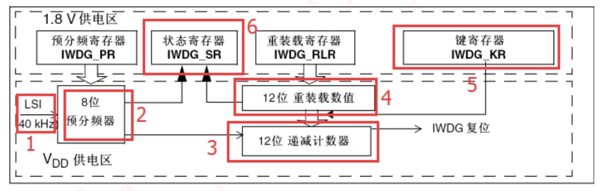

# 独立看门狗 IWDG

- (1)标号 1:IWDG 时钟
    - 由其专用低速时钟 (LSI) 驱动
    - 因此即便在主时钟发生 故障时仍然保持工作状态
    - 其频率一般在 30-60KHz 之间，通常选择 40KHz 作为 IWDG 时钟
- (2)标号 2:预分频器寄存器
    - 8 位预分频寄存器 IWDG_PR 分频后输入给计数器时钟
    - 预分频系数PRE(0-6)
    - `分频因子: 4*2^PRE == 4、8、16、32、64、128、256`
    - 时钟为:CK_CNT= 40/分频因子
- (3)标号 3:计数器
    - 12 位的递减计数器
- (4)标号 4:重装载寄存器    
- (5)标号 5:密钥寄存器
    - 也称为: 关键字寄存器或键寄存器
    - 写入 0X5555，取消写保护  
        - 若写入其他值将重 启写保护
        - 由于 IWDG_PR 和 IWDG_RLR 寄存器具有写访问保护
    - 写入 0XAAAA，把 IWDG_RLR 寄存器内值重装载到计数器中
    - 写入 0XCCCC，启动 IWDG 功能，一旦开启独立看门 狗，它就关不掉，只有复位才能关掉
- (6)标号 6:状态寄存器
    - **只有 位0: PVU 和 位1: RVU 有效**，这两位只能由**硬件**操作   
    - RVU:看门狗计数器重装载值更新。硬件置 1 表示重装载值的更新正在进行中，更新完毕之后由硬件清 0
    - PVU: 看门狗预分频值更新。硬件置 1 表示预分频值的更新正在进行中，当更新完成后，由硬件清 0

# 独立看门狗 (IWDG) 和 窗口看门狗 (WWDG)  

| 特性                  | 独立看门狗 (IWDG)         | 窗口看门狗 (WWDG)         |
|-----------------------|---------------------------|---------------------------|
| **时钟源**            | 独立低速时钟（如 LSI）    | 主时钟（如 APB 时钟）      |
| **喂狗机制**          | 定期刷新计数器            | 必须在时间窗口内喂狗       |
| **时钟独立性**        | 独立于主时钟              | 依赖主时钟                |
| **适用场景**          | 防止系统长时间卡死        | 检测系统运行异常          |
| **复位灵活性**        | 启动后通常无法关闭        | 可通过软件启用或禁用      |

