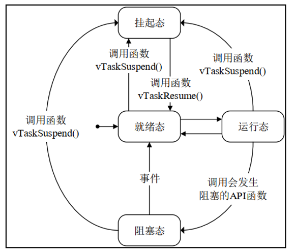
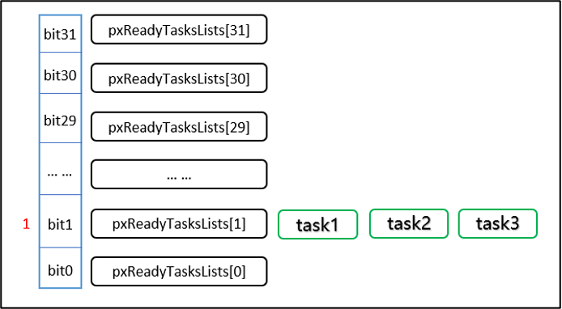

# 关键宏定义

| ​**​宏名称​**​                        | ​**​作用​**​                                         |
| ---------------------------------- | -------------------------------------------------- |
| `configSUPPORT_STATIC_ALLOCATION`  | 启用静态内存分配（任务/队列）                                    |
| `configSUPPORT_DYNAMIC_ALLOCATION` | 启用动态内存分配                                           |
| `INCLUDE_vTaskDelete`              | 允许使用 `vTaskDelete()`                               |
| `configUSE_PREEMPTION`             | 启用抢占式调度                                            |
| `configMAX_PRIORITIES`             | 定义最大任务优先级数（建议 ≤ 32）                                |
| `configUSE_TIME_SLICING`           | 控制是否启用时间片调度 1 启用 0 禁用（禁用后同优先级任务只有当前任务阻塞才会切换） |
| `configTICK_RATE_HZ`               | 系统节拍频率，决定时间片长度（频率越高，时间片越短）。                        |

# FreeRTOS task

| 状态    | 含义说明                                          | 进入方式                                    | 退出方式                                        |
| ----- | --------------------------------------------- | --------------------------------------- | ------------------------------------------- |
| 运行态 X | 任务正在 CPU 上执行                                  | 调度器选择该任务执行时（如高优先级任务就绪、当前任务阻塞）。          | 任务被抢占（更高优先级任务就绪）或主动放弃 CPU（如调用vTaskDelay()）。 |
| 就绪态 R | 任务已准备好执行                                      | 1. 任务创建后 2. 阻塞 / 挂起状态恢复后 3. 被抢占后  | 调度器选中该任务执行时。                                |
| 阻塞态 B | 任务因等待事件而暂停，不参与调度。                             | 调用vTaskDelay()、xSemaphoreTake()等阻塞 API。 | 等待的事件发生（如延时结束、信号量可用）。                       |
| 挂起态 S | 1. 任务被强制暂停 2. 不受调度器管理 3.仅能通过显式调用 API 恢复 | 调用vTaskSuspend()。                       | 调用vTaskResume()或vTaskResumeFromISR()。       |
# 任务控制块（TCB）
- 每个任务都由一个**任务控制块（Task Control Block, TCB）** 描述
- TCB 是 FreeRTOS 管理任务的核心数据结构（定义在`task.h`中）
- TCB 由内核自动创建和维护

| 成员                | 作用说明                                                          |
|-------------------|---------------------------------------------------------------|
| pxTopOfStack      | 任务栈顶指针，保存任务上下文（寄存器状态），上下文切换时使用。                               |
| pcTaskName        | 任务名称（字符串），用于调试和识别任务。                                          |
| uxPriority        | 任务优先级（可通过vTaskPrioritySet()动态修改）。                             |
| pxNext/pxPrevious | 链表指针，将任务链接到就绪列表、阻塞列表等（FreeRTOS 通过链表管理任务）。                     |
| ulRuntimeCounter  | 任务运行时间计数器，用于统计任务占用 CPU 的时间（需开启configGENERATE_RUN_TIME_STATS）。 |
| pxStack           | 任务栈的起始地址（静态创建任务时使用）。                                          |
# 任务优先级

- 会保存一个32位的变量，代表0-31的优先级
- 当某个位置一时，代表所对应的优先级就绪列表有任务存在
- 如果有多个任务优先级相同，会连接在同一个就绪列表上

## 任务优先级 和 中断优先级
| **维度​**​     | ​**​任务优先级（FreeRTOS）​**​      | ​**​中断优先级（NVIC）​**​         |
| ------------ | ---------------------------- | --------------------------- |
| ​**​数值规则​**​ | 数值越大，优先级越高（如3 > 1）           | 数值越小，优先级越高（如0 > 5）          |
| ​**​管理方​**​  | FreeRTOS调度器控制                | 硬件NVIC控制器管理                 |
| ​**​抢占关系​**​ | 高优先级任务可抢占低优先级任务           | 高优先级中断可抢占低优先级中断和所有任务        |
| ​**​范围​**​   | 0 ~ `configMAX_PRIORITIES-1` | 0 ~ 15（ARM Cortex-M默认4位优先级） |

# 时间片调度（Time Slicing）

| 配置项                      | 作用说明                                             | 典型值    |
| ------------------------ | ------------------------------------------------ | ------ |
| `configUSE_PREEMPTION`   | 启用抢占式调度（时间片调度依赖抢占式调度机制），必须设为 1。                  | 1（启用）  |
| `configUSE_TIME_SLICING` | 控制是否启用时间片调度，设为 1 启用，0 禁用（禁用后同优先级任务只有当前任务阻塞才会切换）。 | 1（启用）  |
| `configTICK_RATE_HZ`     | 系统节拍频率，决定时间片长度（频率越高，时间片越短）。                      | 1000Hz |
## **与其他调度方式的对比​**​

|​**​调度方式​**​|​**​特点​**​|​**​适用场景​**​|
|---|---|---|
|​**​抢占式调度​**​|高优先级任务可立即抢占低优先级任务|实时中断响应（如硬件故障）|
|​**​协作式调度​**​|任务主动调用 `taskYIELD()`让出 CPU，无时间片强制切换|确定性时序任务（如工业控制）|
|​**​时间片调度​**​|同优先级任务按固定时间片轮转|多任务均等并发|